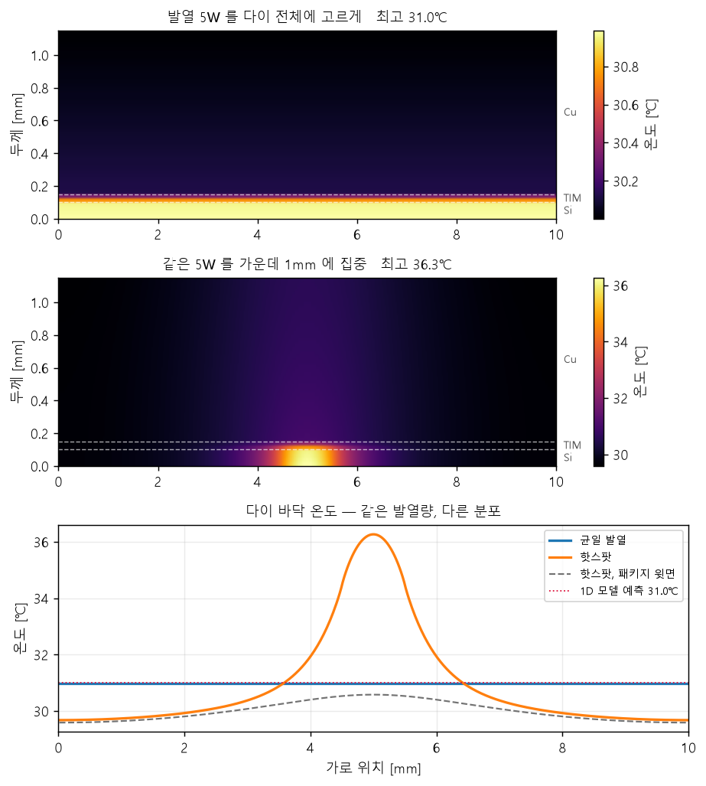
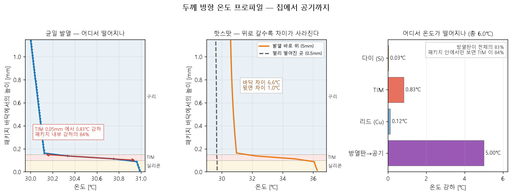
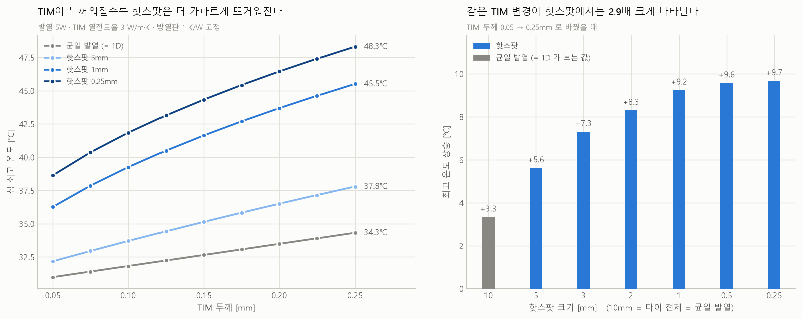
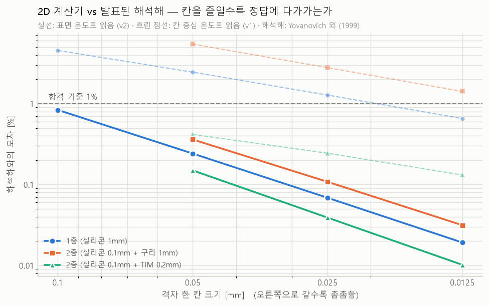
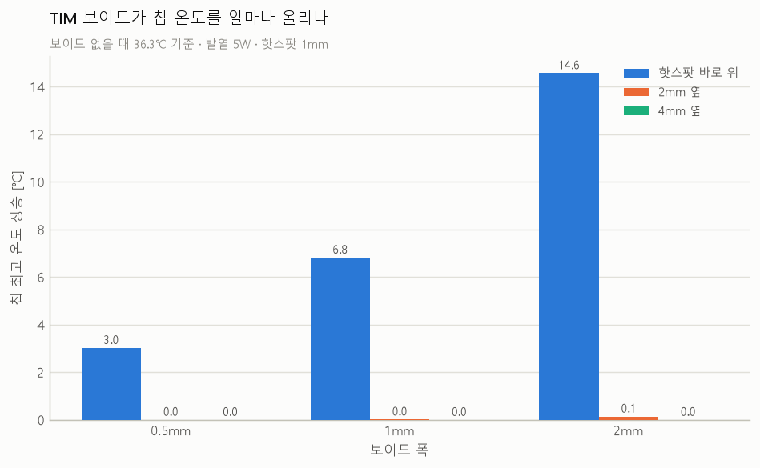

# 반도체 패키지 열 해석 — 1D·2D 계산기, 외부 검증, TIM 보이드

칩(다이) → TIM → 리드 → 방열판으로 이어지는 패키지의 온도를 직접 만든 계산기로 풀고,
발표된 해석해로 계산기를 검증한 뒤, **TIM 보이드(공기 방울 불량)** 가 칩 온도를 얼마나 올리는지 측정한 프로젝트.

> 핵심 결과: 발열이 같아도 한곳(1mm)에 몰리면 칩 최고 온도가 **5.3℃** 더 높고, 1D 모델로는 이 차이를 볼 수 없다.
> TIM 보이드가 핫스팟 바로 위에 있으면 최고 온도가 **최대 14.6℃** 오르지만, 2mm만 비켜나도 **0.1℃ 이하**다.

---

## 1. 1D 열저항 모델 — `scripts/thermal_1d.py`

층을 직렬 열저항으로 보고 `ΔT = Q × R` 로 계산한다. 자체 검증 5/5.

기준 패키지: 다이 10×10mm, 발열 5W, 공기 25℃

| 층 | 두께 | 열전도율 [W/m·K] | 열저항 [K/W] |
|---|---:|---:|---:|
| 다이 (Si) | 0.10mm | 150 | 0.0067 |
| TIM | 0.05mm | 3 | 0.1667 |
| 리드 (Cu) | 1.00mm | 400 | 0.0250 |
| 방열판 → 공기 | — | — | 1.0 |
| **합계** | | | **1.198** |

- 칩 온도 **31.0℃**
- 전체 온도 강하의 **83%가 방열판**, 패키지 내부만 보면 **TIM이 84%** — 가장 얇은 층이 내부 병목

## 2. 2D 유한차분 해석기 — `scripts/thermal_2d.py`

단면을 46 × 400칸(한 칸 0.025mm)으로 나누고, 각 칸에서 "들어온 열 = 나간 열" 을 반복법으로 푼다.

- 재료 경계: 두 칸 사이를 반 칸씩 직렬로 보고 조화평균 열전도율 사용
- 경계: 윗면 방열판(대류), 바닥·옆면 단열
- 반복법: 체커보드 SOR. 수렴이 매우 느린 문제(내부는 잘 통하고 출구가 좁음)를 **1D 해를 초기값**으로 쓰고 **매 스윕 전역 레벨 보정**을 넣어 해결
- 수렴 판정은 "값의 변화량" 이 아니라 "열 균형 잔차" 로 한다 (변화량이 작아도 정답에서 5℃ 떨어져 있던 경우를 실제로 겪음)
- 자체 검증 9/9: 흐트러진 출발점에서 1D 값으로 복귀, 에너지 보존, 선형성, 표면 온도 = 1D 칩 온도 등

| 발열 분포 (총 5W 동일) | 칩 최고 온도 | 다이 평균 |
|---|---:|---:|
| 다이 전체에 균일 | 31.0℃ | 31.0℃ |
| 가운데 1mm 에 집중 | **36.3℃** | 31.0℃ |

평균은 같은데 최고 온도만 5.3℃ 오른다. 1D 모델은 평균만 계산하므로 이 차이를 볼 수 없다.




## 3. 파라미터 스윕

**1단계** (`scripts/sweep_stage1.py`): TIM 두께 9가지 × 핫스팟 크기 7가지 = 63회

TIM 을 0.05 → 0.25mm 로 두껍게 하면 최고 온도 상승이 균일 발열(= 1D)에서는 **+3.3℃**, 0.25mm 핫스팟에서는 **+9.7℃** (**2.9배**).
→ 핫스팟이 있으면 1D 모델은 TIM 두께의 영향을 크게 과소평가한다.



**2단계** (`scripts/sweep_stage2.py`): TIM 두께·열전도율, 핫스팟 크기, 발열, 방열판 저항 5개를 무작위로 800개. 검증용 160개는 샘플링 시점에 미리 분리.

## 4. 외부 검증 — `scripts/validate_spreading.py`, `docs/validation-log.md`

정답지: Yovanovich, Muzychka, Culham (1999), *J. Thermophysics and Heat Transfer* 13(4):495–500 —
띠 모양 열원, 층 구조, 대류 냉각, 옆면 단열이라는 **같은 구조의 문제**에 대한 해석해.

합격 기준은 실행 전에 정했다: 가장 촘촘한 격자에서 1% 이내 + 격자를 줄일수록 오차 감소.

| 조건 | v1 (칸 중심 온도) | v2 (표면 온도) |
|---|---:|---:|
| 1층 (실리콘) | −0.65% 합격 | **+0.019%** 합격 |
| 2층 (실리콘 + 구리) | −1.42% **불합격** | **+0.031%** 합격 |
| 2층 (실리콘 + TIM) | −0.13% 합격 | **+0.010%** 합격 |

- v1 에서 1개 불합격. 오차가 격자를 절반으로 줄일 때마다 일정하게 절반씩 줄어드는 것을 보고,
  원인을 **온도를 표면이 아니라 칸 중심(반 칸 위)에서 읽은 것** 으로 추정
- 수정 후 결과를 **실행 전에 예측해 기록** → v2 실측이 예측과 ±0.002% 이내로 일치
- 불합격 기록(v1)도 지우지 않고 남겼다



## 5. TIM 보이드 — `scripts/void_check.py`

리드를 덮어 누르는 공정에서 TIM 안에 공기가 갇히는 불량. TIM 층의 칸 일부를 공기(0.026 W/m·K)로 바꿔 계산했다.

보이드 없을 때 36.3℃ 기준, 최고 온도 상승:

| 보이드 폭 | 핫스팟 바로 위 | 2mm 옆 | 4mm 옆 |
|---|---:|---:|---:|
| 0.5mm | +3.0℃ | 0.0℃ | 0.0℃ |
| 1mm | +6.8℃ | 0.0℃ | 0.0℃ |
| 2mm | **+14.6℃** | 0.1℃ | 0.0℃ |

같은 크기의 불량도 **위치**에 따라 결과가 완전히 다르다. 1D 모델과 위 해석해는 모두 TIM 을 균일하다고 가정하므로 이 효과를 계산할 수 없다.



**보이드 데이터** (`scripts/sweep_void.py`): 위 5개 조건 + 보이드 폭·위치로 800개 (보이드 있음 627 / 없음 173, 학습 640 / 검증 160).

## 6. 선행연구 — `docs/literature-review.md`

- 패키지 온도 AI 대리모델은 이미 있다 (HBM, 2.5D 등). 대부분 순수 데이터 방식이고 수천~1만여 개의 시뮬레이션을 쓴다
- "저렴한 모델 + 정밀 시뮬레이션 소량" 으로 데이터를 줄이는 방법은 칩 열 해석(다중 충실도)과 패키지 휨 분야에 이미 있다
- 이 프로젝트에서 남은 질문으로 좁힌 것: **패키지 설계 변수 + TIM 보이드** 조건에서, 해석 공식을 기준선으로 넣으면 필요한 시뮬레이션 수가 얼마나 줄어드는가 (진행 중)

조사는 웹 검색과 공개 논문 DB 로 했으며 완전하지 않다. 확인 수준을 문서에 표시했다.

---

## 한계

- **2D 단면**이다. 핫스팟과 보이드가 깊이 방향으로 이어진 띠가 되므로, 같은 발열 밀도의 실제 3D 조건보다 온도를 높게 계산할 것으로 추정한다
- 정상상태만 계산. 바닥(기판) 쪽 열 경로는 단열로 막았고, 방열판과 리드–방열판 사이 TIM 은 저항 하나(1 K/W)로 묶었다
- **실측 데이터와 비교하지 않았다.** 외부 검증은 해석해가 다루는 2층 구조까지이고, 3층 전체는 직접 검증하지 못했다
- 스윕 1·2단계 데이터는 수정 전 방식(칸 중심 온도)으로 계산돼 확산 저항이 약 1.3~2.8% 작게 나왔다. 보이드 데이터부터 표면 온도를 쓴다
- 발열 전체를 한 핫스팟에 몰아넣는 등 극단적인 조건을 포함한다

## 실행

Python 3.11, numpy, matplotlib (scipy 불필요)

```bash
python scripts/thermal_1d.py          # 1D 모델 + 자체 검증
python scripts/thermal_2d.py          # 2D 해석기 + 자체 검증
python scripts/plot_2d.py             # 온도 분포 그림
python scripts/validate_spreading.py  # 외부 검증 (약 8분)
python scripts/void_check.py          # TIM 보이드 효과
python scripts/sweep_void.py          # 보이드 데이터 800개 (약 40분, 중단 후 재실행 시 이어서)
```

## 폴더

```
scripts/   계산기, 스윕, 검증, 그림
data/      계산 결과 (CSV, JSON, 실행 로그)
figures/   그림
docs/      선행연구 조사, 외부 검증 기록
```

## 진행 중

보이드 데이터로 대리모델을 학습해, 기준선(없음 / 1D 공식)에 따라 목표 정확도에 필요한 학습 데이터 수가 어떻게 달라지는지 비교한다.

---

코드 작성과 분석에 AI 코딩 도구(Claude Code)를 함께 사용했다.
